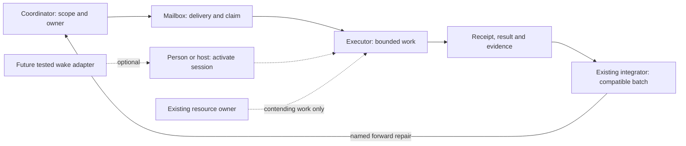

# Agent mail coordinator

A small skill and file-mail toolkit for requested coordinator/executor handoffs.
Use separate participant IDs for Codex-only, Claude-only, mixed, or other-agent
teams. It carries work and receipts; people or the host agent system activate
sessions. It does not run agents, install daemons, poll, or schedule jobs.

**Private review package. No open-source license is granted.**
See [provenance and rights](references/provenance.md) before redistribution.

## Why this exists

This started while the owner was coordinating Codex and Claude on a complex
game project. Work was happening in several places, but handoffs were easy to
miss, two workers could approach the same file, queues could sit idle, and a
finished piece did not always reach the integrated result.

The useful idea was small: give work an address, one owner, a receipt and a
clear return path. A coordinator sends a bounded packet; an executor claims it,
returns evidence, and hands it to the existing integrator. Sending a packet is
delivery. A receiver must still be activated and acknowledge it. That distinction
keeps a quiet inbox from being mistaken for a working session.



The same shape can help a software build/test team, a researcher handing a
source-backed draft to a reviewer, or a production workflow moving a prepared
asset to its assembler. Those are workflow examples, not claims of tested
domain integrations. This package's executable proof uses synthetic participants
and local files.

| Example setup | Participant engines | What is supported here |
| --- | --- | --- |
| Codex-only build and review | Codex lead + separately named Codex workers | Same manual mailbox and ownership contract |
| Claude-only research and edit | Claude lead + separately named Claude workers | Same manual mailbox and ownership contract |
| Mixed production handoff | Codex lead + Claude executor (or the reverse) | Same routing; engine does not select the owner |
| Another agent host | Configured `other` participant | CLI boundary; host skill discovery/session control needs its own test |

Human control stays with the existing user and host: mail grants no permission,
STOP halts ordinary mailbox actions, ownership changes need acceptance, and
stale recovery requires an explicit operator decision. The toolkit labels roles;
it does not authenticate people or sandbox source edits. A future tested adapter
could wake a specific supported session or carry an envelope through another
transport. It must report those capabilities separately and preserve the same
receipt and ownership rules.

## Try it

Requires Node.js 22 or later. There are no npm dependencies or install scripts.
From this directory:

```sh
npm test
node scripts/demo.mjs
```

The tests and demo create isolated synthetic mailboxes, never contact live
agents, and clean their own temporary data. The demo shows coordinator dispatch,
executor claim, ACK, result, completion and an unsupported wake request.

Copy one of `examples/config-mixed.json`, `examples/config-codex.json`, or
`examples/config-claude.json` into your own project-local private configuration.
Set its project/mailbox roots and allowlist to your project. Keep local config,
claim tokens, mailbox state and evidence out of the repository. CLI usage and
exit codes are in [protocol](references/protocol.md).

## Install the skill

Copy this directory into a skill directory supported by your host, named
`agent-mail-coordinator`. For Codex, the usual user directory is
`~/.codex/skills/agent-mail-coordinator`; for Claude Code it is
`~/.claude/skills/agent-mail-coordinator`. These are manual installation examples;
no existing skill is overwritten by this package. Confirm your host discovers
the top-level `SKILL.md`; then ask it to use `$agent-mail-coordinator` for a
bounded handoff. Other hosts can consume `SKILL.md` and use the same CLI, subject
to their own tool and permission model.

The directory remains self-contained: scripts and references are relative to
the skill. Machine/project configuration remains external. Installing a skill
does not connect it to another session or authorize public GitHub comments.

## Small architecture

`SKILL.md` routes the agent to role/workflow references. `scripts/mail.mjs` is a
JSON CLI around `scripts/mailbox.mjs`. The core commits a whole state snapshot
under a bounded exclusive file lock, with durable idempotency and session-fenced
claims. [message.schema.json](references/message.schema.json) describes the
stored envelopes. [adapters](references/adapters.md) separates local transport
from session control and optional manual PR handoffs.

`adapters/legacy-mail.ps1` retains the inspected Windows Codex/Claude trial script
byte-for-byte. It has its own original protocol and limits; use it only for an
existing trial-format mailbox, never against the generalized state directory.

See [tests and platform limits](references/validation.md) for what was actually
run. This is local same-user coordination, not a distributed queue or an
authentication/sandbox boundary.
