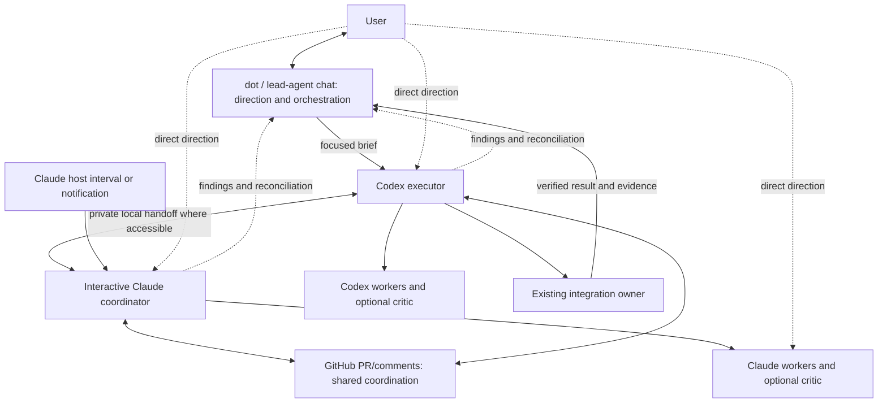

# Coordinate agents across Claude, Codex, and beyond.

Talk to a lead agent. Let coordinators and executors organize the work. Use
GitHub for shared progress and local agent mail for private handoffs, with
clear ownership across sessions.

`agent-mail-coordinator` is a small skill and local file-mail toolkit.
GitHub handoffs use existing authorized tools; session activation comes from
the host. It supports Codex-only, Claude-only, mixed and other-agent workflows.

**Private review package. No open-source license is granted.**
See [provenance and rights](references/provenance.md) before redistribution.

## Operating example: dot / lead chat, Codex executor and Claude coordinator

The user chats mainly with **dot**, or an interchangeable **lead-agent chat**:
the user-facing orchestrator that holds project direction/context, translates
requests into focused briefs, delegates, reconciles findings and reports back.
The owner reports that a **Codex executor** and an interactive **Claude
coordinator session** coordinate primarily through **GitHub PRs/comments**.
They use local agent mail for sensitive or machine-local handoffs. Background
checks and interval wake-ups configured by the Claude session keep those
surfaces in sync. Each platform
can manage its own workers and critics through its native tools.

A pre-existing **Claude Routine is not required**. The receiving session uses
its host's scheduling or notification tools; mailbox arrival alone does not
wake it. This is user-reported functioning usage, not an independent test of
that session's exact APIs, timing or lifetime. The inspected coordinator guidance
describes session cron and background notifications; Claude Code separately
documents session scheduling and cloud Routines. See
[host-owned receiving setup and limits](references/adapters.md#interactive-claude-session-background-receiving)
and [Claude Code scheduling](https://code.claude.com/docs/en/scheduled-tasks).



These are logical responsibilities, not a required product/process hierarchy.
Another capable chat can be the lead; small teams can combine roles. Codex-only,
Claude-only and other mixed configurations use the same boundaries. The user
can address any coordinator, executor or worker directly; relevant owners and
the lead reconcile changed direction. The toolkit does not implement the chat
host or the orchestrator's session manager.

## Why this exists

This started while the owner was coordinating Codex and Claude on a complex
game project. Work was happening in several places, but handoffs were easy to
miss, two workers could approach the same file, queues could sit idle, and a
finished piece did not always reach the integrated result.

The useful idea was small: give work an address, one owner, a receipt and a
clear return path. The lead keeps intent coherent while the team turns separate
pieces into an integrated result. A direct instruction to any worker remains
visible to relevant owners, rather than widening a claim or getting lost.

Sending a packet alone is delivery. A separately configured host timer or
notification can activate the receiving session; neither a send nor a timer
proves receipt. Status, named lanes/sessions, ACKs and artifact identities make progress
inspectable; active badges and posted plans do not prove an integrated result.
The package supplies local status and receipt data, not a universal dashboard or
cross-platform agent manager. See [topology](references/topology.md).

The same shape can help a software build/test team, a researcher handing a
source-backed draft to a reviewer, or a production workflow moving a prepared
asset to its assembler. Those are workflow examples, not claims of tested
domain integrations. This package's executable proof uses synthetic participants
and local files.

| Example setup | Participant engines | What is supported here |
| --- | --- | --- |
| Codex-only build and review | Codex lead + separately named Codex workers | Same manual mailbox and ownership contract |
| Claude-only research and edit | Claude lead + separately named Claude workers | Same manual mailbox and ownership contract |
| Mixed production handoff | Codex lead + Claude executor (or the reverse) | Same routing; engine does not select the owner |
| Another agent host | Configured `other` participant | CLI boundary; host skill discovery/session control needs its own test |

Human control stays with the existing user and host: mail grants no permission,
STOP halts ordinary mailbox actions, ownership changes need acceptance, and
stale recovery requires an explicit operator decision. The toolkit labels roles;
it does not authenticate people or sandbox source edits. Its `wake: false` and
`stopSession: false` describe the toolkit-native manual adapter, not the host's
separately available scheduling or session tools. A future tested toolkit adapter
could wake a specific supported session or carry an envelope through another
transport. It must report those capabilities separately and preserve the same
receipt and ownership rules.

## A complete handoff, including a user interjection

For a synthetic catalog job, the user speaks to dot / a lead-agent chat, which
refines the goal and asks an executor to normalize labels.
The executor and coordinator reserve an output file and hand it to a named
worker. The user then tells that worker, “Keep the original label too.” The worker
checkpoints its work, records the changed acceptance and sends an update upward.
That refinement fits the same output reservation; another requested file would
need a new ownership decision and packet before editing.

A reviewer finds the first candidate lost original labels. The failed candidate
and RED evidence stay retained. The same named forward fixer repairs it, the
same reviewer checks the affected behavior, and the existing integrator copies
the passing bytes into the combined result. The user sees the reconciled
direction, ACKs, RED→PASS repair, integrated hash and remaining limitations.
This is actual synthetic file processing, not a recorded conversation or a live
agent trial. [Worked example](references/worked-example.md) shows the steps and
sequence diagram; the runnable demo makes the evidence observable.

## Local mail and GitHub PRs: use both without two queues

| Surface | Access and purpose | Receipts and limits |
| --- | --- | --- |
| GitHub PRs/comments | Primary shared surface in the reported workflow; accessible across hosts with authorized repository access. Keep agreed direction, owner, code-linked review and sanitized status here. | A saved post is delivery; a receiver reply is ACK; a tested receiving commit is applied. No atomic mailbox claim or CLI GitHub transport ships here. |
| Local filesystem mail | Sensitive/machine-local payloads and exact local handoffs; consumers need access to the same permitted mailbox location. | CLI persists messages, fenced claims, ACK/result receipts and retries. Privacy depends on filesystem permissions; there is no encryption or authentication guarantee. |

Keep one canonical coordination ledger, here the agreed PR/thread, and one
stable packet key connecting its public-safe summary to the authorized private
payload, local claim and ACK/result. Do not dispatch an independent duplicate
task on the other surface. Absolute machine paths, credentials, tokens and
private payloads stay off GitHub, including private PRs. Relay only the agreed
decision/status and repository-relative evidence. Neither route alone grants
execution authority or wakes a session. The supported bridge is manual or
agent-relayed through authorized host tools, not a built-in GitHub adapter;
[bridge steps and conflict handling](references/adapters.md#using-local-mail-and-pr-comments-together)
give the full boundary. Local-only work remains supported without GitHub.

## Try it

Requires Node.js 22 or later. There are no npm dependencies or install scripts.
From this directory:

```sh
npm test
node scripts/demo.mjs
node scripts/topology-demo.mjs mixed
node scripts/topology-demo.mjs codex
node scripts/topology-demo.mjs claude
node scripts/topology-demo.mjs mixed --outside-direction
```

The tests and demo create isolated synthetic mailboxes, never contact live
agents, and clean their own temporary data. The demo shows coordinator dispatch,
executor claim, ACK, result, completion and an unsupported wake request.
The topology demo additionally simulates separate platform workers, direct user
direction, reconciliation, retained failure, forward repair and integrated-byte
verification. It does not launch workers or receive real host chat events.

Copy one of `examples/config-mixed.json`, `examples/config-codex.json`, or
`examples/config-claude.json` into your own project-local private configuration.
`examples/config-topology.json` illustrates separate leader/coordinator/executor
assignments. Its `workflowAssignments` field is descriptive metadata; leader and
integrator use existing coordinator role labels, not new execution privileges.
Set its project/mailbox roots and allowlist to your project. Keep local config,
claim tokens, mailbox state and evidence out of the repository. CLI usage and
exit codes are in [protocol](references/protocol.md).

## Install the skill

Copy this directory into a skill directory supported by your host, named
`agent-mail-coordinator`. For Codex, the usual user directory is
`~/.codex/skills/agent-mail-coordinator`; for Claude Code it is
`~/.claude/skills/agent-mail-coordinator`. These are manual installation examples;
no existing skill is overwritten by this package. Confirm your host discovers
the top-level `SKILL.md`, then invoke it by name through that host's supported
mechanism (`$agent-mail-coordinator` is the Codex example). Other hosts can
consume `SKILL.md` and use the same CLI, subject
to their own tool and permission model.

The directory remains self-contained: scripts and references are relative to
the skill. Machine/project configuration remains external. Installing a skill
does not connect it to another session or authorize public GitHub comments.

## Small architecture

`SKILL.md` routes the agent to role/workflow references. `scripts/mail.mjs` is a
JSON CLI around `scripts/mailbox.mjs`. The core commits a whole state snapshot
under a bounded exclusive file lock, with durable idempotency and session-fenced
claims. [message.schema.json](references/message.schema.json) describes the
stored envelopes. [adapters](references/adapters.md) separates local transport
from session control and optional manual PR handoffs.

`adapters/legacy-mail.ps1` retains the inspected Windows Codex/Claude trial script
byte-for-byte. It has its own original protocol and limits; use it only for an
existing trial-format mailbox, never against the generalized state directory.

See [private review findings](references/public-review.md) and
[tests and platform limits](references/validation.md) for what was actually
run. This is local same-user coordination, not a distributed queue or an
authentication/sandbox boundary.
