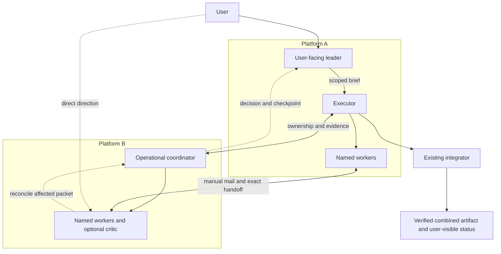

# Leader, coordinator, executor and platform teams

The user usually chats with a user-facing leader. In the originating arrangement
that Codex-side leader is called **dot**. It could instead be a leader chat in
Claude or another capable host. The executor and operational coordinator are
different responsibilities; the coordinator currently runs in Claude Code in
that arrangement, but is configurable. Names and products are examples, not
hardcoded service identities or claims of automatic compatibility.

The leader refines intent and sends a useful brief to an executor. The executor
works with a coordinator to route work, reserve seams and return evidence. Each
platform can maintain its own agents/workers through its supported native tools.
Local mail and exact handoff interfaces join those teams. This package implements
the mail boundary, not those native agent managers.

For a small Codex-only or Claude-only arrangement, leader and coordinator may be
one participant. For larger same-platform teams they can be separate IDs. Mixed
arrangements can swap either product. An `other` engine uses the manual CLI if
the host can read the skill and execute it; native discovery, plugins, waking
and stopping require separate verification and authorization.

In the executable config `role` is a small routing/reservation category.
Leader and integrator are workflow assignments mapped to existing coordinator
labels. `workflowAssignments` in the topology example is descriptive metadata,
not a core-enforced privilege. Engine is a host label. Session is the individual
claiming context; a lane is a named stream of work. None is authentication.

## Direct user direction

The user can speak to the leader, coordinator, executor, reviewer or any worker.
Do not insist that they re-enter the same request through a special front door.
Their new instruction takes precedence in the recipient's session, within its
real permissions. The recipient still reconciles shared ownership and evidence:

1. Record a concise direction revision tied to the packet. Identify affected
   paths, acceptance, dependencies and current owners; do not copy the chat log.
2. Checkpoint affected work. Preserve inputs, original goal and failed evidence.
   A refinement inside the current write scope can retain its claim/session.
3. Notify the leader/coordinator through the authorized route. Delivery is not
   an ACK. If the host cannot wake it, record the pending activation and return
   a pointer to the user; no guessed queue or polling loop.
4. Resolve overlapping ownership or changed scope before those edits. Immutable
   packets are not rewritten in place. Finish/release the old work through its
   documented lifecycle, then dispatch a new reconciled packet for new scope.
   An out-of-scope direction is held with its owner/next action, not silently
   dropped or implemented by a competing writer.
5. Recheck affected acceptance. Share the changed decision and real completion
   evidence upward; independently useful authorized work continues.

## Observable delivery

Keep one compact ledger: lane/participant, platform/session label, packet and
direction revision, exact reservation, receipt state, tested source/artifact,
remaining blocker and next owner. Host UI may already show sessions or active
badges; use it where actually available. The CLI supplies status, receipts,
claim state and evidence references, not a live multi-platform dashboard.

Leaders keep intent and updates concise; coordinators keep routing and open
actions coherent; executors return bounded evidence. Activity is not completion.
User-visible completion names the integrated artifact/commit, its actual checks,
remaining limits and next action. Keep prepared/delivered/acknowledged/applied
distinct from implemented/reviewed/integrated/accepted/published/verified.

See [worked example](worked-example.md) and `scripts/topology-demo.mjs` for an
anonymized executable illustration. The demo simulates host workers and a user
interjection; it neither receives actual chat events nor launches other agents.
