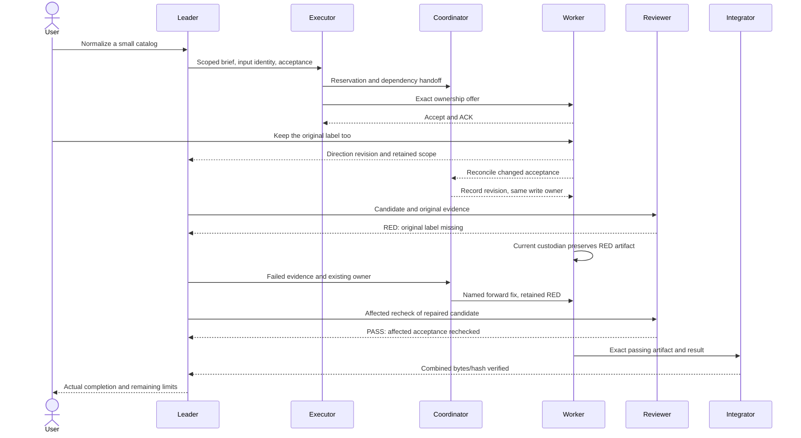

# An anonymized end-to-end handoff

Run `node scripts/topology-demo.mjs mixed` for the synthetic file-processing
example. `codex` and `claude` use same-platform engine labels; `mixed` assigns
different labels. None starts an actual agent. The ledger models manual host
actions, not an automatic chat listener, notification service or agent manager.

The leader refines a source-processing request into a bounded packet with input
hashes and one output reservation. The executor arranges the handoff with the
coordinator and transfers write custody to a named worker only after acceptance.
Each recipient has a separate participant/session label. Other platform workers
can prepare independent inputs without claiming the same output.

The direct user refinement changes acceptance inside that reservation. The
worker keeps the same claim/token and emits a concise note tied to the packet;
the leader/coordinator reconcile it through a separate authorized handoff.
Nobody replies to a terminal note. Recorded decision and actual receiver ACK
remain distinct. If delivery cannot activate the receiver, the pending action
remains visible rather than being considered handled.

The first candidate deliberately lacks original labels. The reviewer reports
RED to the leader; the current output custodian persists that evidence, and the
leader passes it to the coordinator to name the existing worker as forward
fixer. That artifact remains available while the worker creates a corrected
candidate. The same reviewer checks the changed behavior; its PASS names the
actual candidate rather than accepting a plan. The existing integrator then
verifies the combined artifact equals the passing bytes and reports its hash.
The cleaned-up demo output retains sanitized artifact content and a stage ledger
for inspection, while temporary files and claim tokens stay private.

`--outside-direction` adds a request beyond the worker's write reservation. The
demo holds that portion, records its affected owner/next action and notifies the
leader/coordinator. Both user-facing results are `partial`, naming the leader
and the next input-ownership reconciliation packet. It does not edit the
additional file or claim that the
direction was fully completed. The safe original slice can still progress;
changed scope requires a new reconciled packet, not an edited immutable message.

This executable illustration proves local routing, scope preservation and real
synthetic artifact checks. User interjections and native platform workers are
simulated. It does not prove live user-event capture, cross-host waking, plugin
compatibility, or a rendered product experience. Those require their own
authorized host adapters and evidence.
